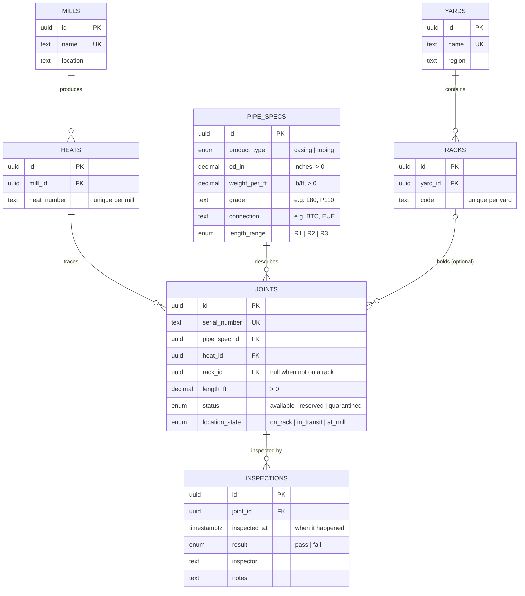

# Database Schema

PostgreSQL 16, managed with `sequelize-cli` migrations in [`server/src/db/migrations/`](../server/src/db/migrations/). The migrations are the source of truth; this doc explains the shape and the reasoning.

## Entity Relationship Diagram



Every table except `inspections` also has `created_at` and `updated_at`. `inspections` has `created_at` only (see [Design decisions](#design-decisions)).

## Tables

| Table | One row per | Notes |
|---|---|---|
| `mills` | Steel mill | |
| `heats` | Heat (batch of steel) at a mill | Heat numbers can repeat across mills, not within one |
| `pipe_specs` | Distinct pipe specification | A spec is the combination of all six spec columns, including casing/tubing |
| `yards` | Storage yard | |
| `racks` | Rack within a yard | Rack codes can repeat across yards, not within one |
| `joints` | Physical joint of pipe | The core table. Mill is reached through `heat_id`, yard through `rack_id` |
| `inspections` | Inspection event | Append-only history |

## Constraints

| Rule | Enforced by |
|---|---|
| Status, product type, length range, location state and inspection result accept only known values | Postgres enums |
| No duplicate specs | `uq_pipe_specs_spec` on all six spec columns |
| Heat number unique per mill; rack code unique per yard; serial number unique globally | `uq_heats_mill_heat_number`, `uq_racks_yard_code`, unique on `serial_number` |
| OD, weight per foot and joint length must be positive | `ck_pipe_specs_od_positive`, `ck_pipe_specs_weight_positive`, `ck_joints_length_positive` |
| Identifiers and names can't be blank or whitespace | `ck_*_not_blank` (serial, heat number, rack code, mill/yard name, grade, connection) |
| A joint has a rack **if and only if** it is `on_rack` | `ck_joints_rack_matches_location` |
| A row that others reference can't be deleted (e.g. a joint with inspections) | Foreign keys (default `NO ACTION`) |

Joint counts are never stored, so they can't go negative: they're calculated with `COUNT(*)` in `inventory_summary`.

## Views

**`inventory_summary`**: inventory by spec and location, in joints and total footage. One row per combination of spec, yard, rack, `location_state` and `status`, with `joints` (`COUNT(*)`) and `total_footage` (`SUM(length_ft)`). Joints that aren't on a rack (in transit or at the mill) are included, with `yard` and `rack` as `NULL`.

```sql
SELECT yard, rack, joints, total_footage
FROM inventory_summary
WHERE product_type = 'tubing' AND status = 'available';
```

**`joint_latest_inspection`**: each joint's most recent inspection (`last_inspected_at`, `last_result`, `last_inspector`). "Most recent" means latest `inspected_at`, so a backdated entry typed in later doesn't count as the latest. Joints never inspected don't appear; `LEFT JOIN` to it from `joints` to include them.

## Design decisions

- **One row per joint.** Partial reservations and quarantines (40 of 100 joints) are just updates to those 40 rows. Totals come from the view.
- **Store facts once, derive the rest.** Counts, footage and "last inspection" are views, not stored columns, so they can't drift out of sync with the rows they summarize.
- **Status and location are separate columns.** `status` answers "can this be used?"; `location_state` answers "where is it?". A joint can be `reserved` and `in_transit` at the same time.
- **Inspections are append-only.** No `updated_at` and no trigger. Corrections are recorded as a new inspection, which keeps the full history.
- **`updated_at` is maintained by the database.** A `BEFORE UPDATE` trigger (`set_updated_at()`) on every table except `inspections` stamps `updated_at = now()`, so it stays correct for updates from psql, raw SQL or the agent, not just from Sequelize.
- **`DECIMAL` for measurements**, so values are exact. The `pg` driver returns `DECIMAL`, `COUNT` and `SUM` results to JavaScript as **strings**; convert them in the app layer.

## Migrations

| Migration | Adds |
|---|---|
| `create-initial-schema` | Enums, the 7 tables, foreign keys, unique constraints, the rack/location CHECK, indexes |
| `add-data-quality-checks` | Positive-number and not-blank CHECKs |
| `add-updated-at-trigger` | `set_updated_at()` and a trigger on each mutable table |
| `create-views` | `joint_latest_inspection`, `inventory_summary` |

Migration files use the `.cjs` extension because `server/package.json` sets `"type": "module"` and `sequelize-cli` loads files with `require()`. Once a migration has been pushed, don't edit it; add a new one.
